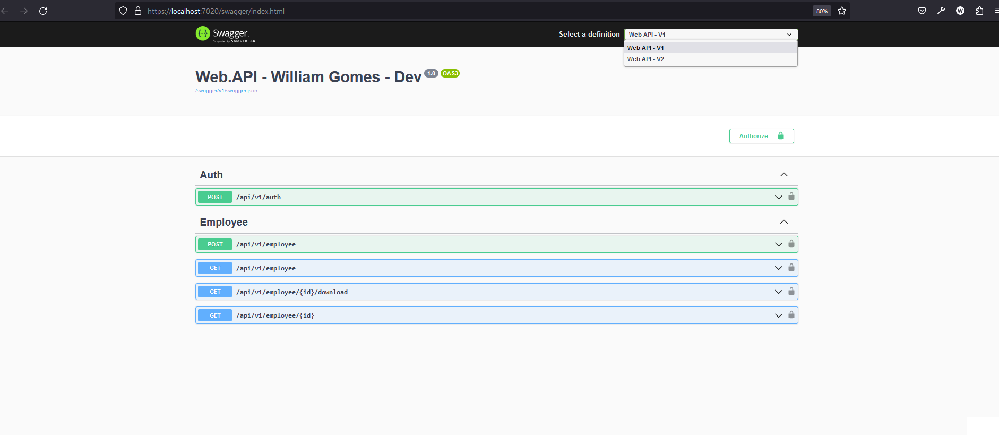

<p align="center">
  <a href="#page_with_curl-project">📃 Project</a>&nbsp;&nbsp;&nbsp;|&nbsp;&nbsp;&nbsp;
  <a href="#information_source-how-to-use">ℹ️ How To Use</a>&nbsp;&nbsp;&nbsp;|&nbsp;&nbsp;&nbsp;
  <a href="#rocket-used-libraries">🚀 Technologies</a>&nbsp;&nbsp;&nbsp;|&nbsp;&nbsp;&nbsp;
  <a href="#man_technologist-author">👨‍💻 Author</a>&nbsp;&nbsp;&nbsp;
</p>

## Projeto EmployeeAPI



## :information_source: How To Use

1- Clone the repository

```bash
git clone https://github.com/williamjayjay/dotnetApiEmployee
```

## :rocket: Used libraries

- [ASP NET Core 7]
- [Entity Framework]
- [PostgreSQL]

## :man_technologist: Author

<div align="center">
 <p>Developed by William Gomes</p>
<div>
<table>
  <tr>
    <td align="center">
      <a href="http://github.com/williamjayjay/">
        
        <br />
        <sub>
          <b>William Gomes</b>
        </sub>
       </a>
       </td>
  </tr>
</table>
</div>

[](https://www.linkedin.com/in/william-gomes-aab694149/)

</div>